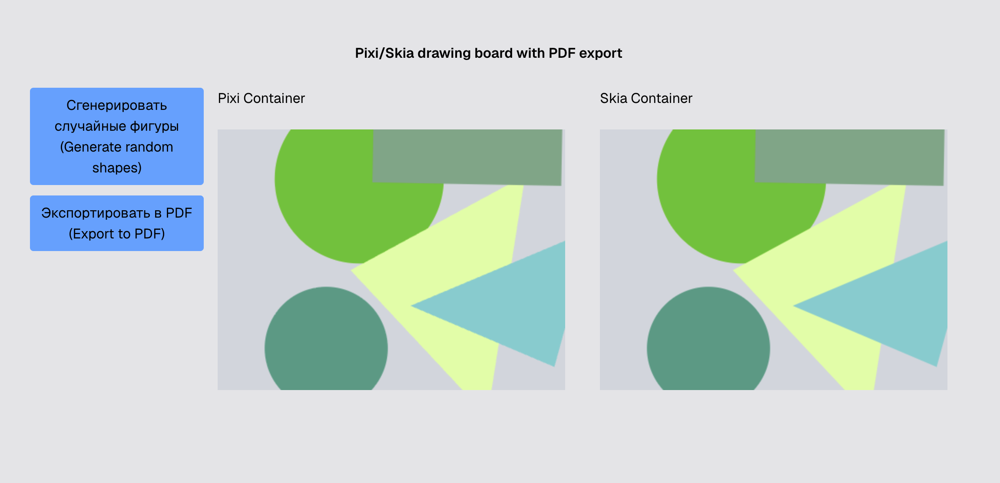

# Pixi.js + Skia Rendering Playground

A rendering playground demonstrating how a Pixi.js scene can be rendered using Skia (CanvasKit) and exported as a vector PDF.

#### Live demo: https://draw-pixi-skia-pdf-od.netlify.app/ (use vpn if needed)

## Technologies

- React
- Next.js
- TypeScript
- Pixi.js
- Skia CanvasKit / CanvasKit Pdf Backend
- WebAssembly (WASM) - custom compiled wasm build of CanvasKit with PDFDocument bindings
- Tailwind CSS
- Prettier / Eslint

## Features

- Render vector graphics using Pixi.js (random circle, triangle, rectangular shapes)
- Render the same scene using Skia CanvasKit
- Shared scene representation between renderers
- Export scenes to vector PDF

## Technical Highlights

### PDF Export

PDF export is implemented using Skia's native PDF APIs:

- `SkPDF::MakeDocument`
- `SkDynamicMemoryWStream`
- Custom Emscripten bindings
- TypedArray byte extraction for browser download

The generated PDF contains vector content rather than a rasterized screenshot.

### Architecture

```text
Pixi Scene
    ↓
Scene Traversal
    ↓
Skia Renderer
    ↓
CanvasKit Surface
    ↓
Screen Rendering

Pixi Scene
    ↓
Scene Traversal
    ↓
Skia PDF Backend
    ↓
PDF Export
```

## Project Structure

Project uses FSD (Feature-Sliced Design) folder structure where functionality is separates into:

- app (Next.js uses it for routing)
- screens - pages-like folder to combine widgets and features
- widgets - like Navbar, SkiaBoard and PixiBoard sections
- features - user features like export to PDF
- entities - business entities like graphics object and scene
- shared - ui elements like Button, constants and types

## Installation

```bash
npm install
```

## Development

```bash
npm run dev
```

Open:

```text
http://localhost:3000
```

## Production Build

```bash
npm run build
npm run start
```

## Future Improvements

- Sprite rendering support
- Advanced transforms
- PDF metadata configuration

## Screenshots / PDF file

[Skia Scene PDF](public/files/skia_scene.pdf)



